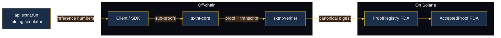

<div align="center">


# SXTNT

**Few stars. Whole position.**

A folding ZK coprocessor. Sub-proofs in, one verifiable measurement out.

[](https://sxtnt.fun)
[](https://x.com/sxtnt_zk)
[](./docs/architecture.md)
[](./LICENSE)
[](#on-chain-interface)
[](#getting-started)
[](./sdk/typescript)
[](./docs/folding-schemes.md)
[](https://github.com/sxtnt-zk/sxtnt/actions/workflows/ci.yml)
[](https://github.com/sxtnt-zk/sxtnt/stargazers)

</div>

---

## Introduction

A 19th-century navigator pinpointed their position from a handful of
stars. They did not measure every visible point in the sky — they
chose three or four, marked angles with a sextant, and folded the
measurements into one fix.

SXTNT is the same idea applied to verifiable computation. Hundreds of
small sub-proofs go in. One folded accumulator comes out. Solana
verifies it against the canonical digest in constant time.

This repository is the **research-grade reference implementation** of
the folding scheme behind SXTNT. It compiles, tests, and ships the
exact byte layouts the production verifier uses. The full mainnet
verifier program lives in a separate deploy; the on-chain account
layout and the proof digest construction here are byte-identical to
what that deploy expects.

## Why folding

A vanilla ZK rollup pays the proving cost of every sub-instance in
sequence. Folding compresses N sub-instances into one with a single
random linear combination per step, so the heavy prover work
amortises to roughly one full proof at the end of the chain. The
result is the same soundness guarantee, but the on-chain verifier
sees one digest instead of N.

For a chain of 1024 sub-proofs over the reference circuit:

| | Vanilla recursive SNARK | SXTNT folding |
| --- | --- | --- |
| On-chain verifier calls | 1024 | 1 |
| Final proof size | ~ N × 200 B | ~ 256 B (digest + commitments) |
| Verifier work | O(N) | O(log N) for transcript replay, O(1) on-chain |

The exact numbers depend on the inner circuit; the reference
folding simulator at [`api.sxtnt.fun /folding/simulate`](https://api.sxtnt.fun)
returns step-by-step accumulator state so you can compare your own
prover against the reference.

## Architecture



The codebase is organised in four layers — `core`, `verifier`,
`onchain`, and the TypeScript SDK. Each layer is documented in
[`docs/architecture.md`](./docs/architecture.md). The relaxed-R1CS
arithmetic in `crates/core/src/accumulator.rs` is the canonical fold
step; everything else binds to it.

## Getting started

### Rust workspace

```bash
git clone https://github.com/sxtnt-zk/sxtnt.git
cd sxtnt
cargo check --workspace
cargo test --workspace --no-run
```

The workspace pins Rust 1.79+. Three crates live under `crates/`:

| Crate | What it does |
| --- | --- |
| `sxtnt-core` | Folding primitives — accumulator, commitment, fold step, scheme trait. |
| `sxtnt-verifier` | Fiat-Shamir transcript + `verify_proof` entry point. |
| `sxtnt-onchain` | Solana account layout, instruction set, canonical proof digest. |

### Run the Nova example

```bash
cargo run -p sxtnt-core --example nova-fold
```

Builds four satisfied relaxed-R1CS instances, folds them with Nova,
and verifies the resulting proof. The full source is in
[`crates/core/examples/nova-fold.rs`](./crates/core/examples/nova-fold.rs).

### TypeScript SDK

```bash
cd sdk/typescript
npm install
npm run build
```

The SDK exposes a `SxtntClient` that builds the instruction bytes for
`init_registry` and `accept_proof`, plus `proofDigest()` — the same
byte-exact digest the on-chain program recomputes. See
[`examples/verify-onchain.ts`](./examples/verify-onchain.ts) for a
walk-through.

## Folding schemes

SXTNT implements all three members of the Nova family behind a single
`FoldingScheme` trait:

* **Nova** — single circuit, smallest fold step, easiest audit.
* **SuperNova** — N circuits with a per-step selector. Good fit for
  zkVM-shaped workloads.
* **HyperNova** — CCS-based, batched parallel fold. Higher-degree
  constraints, tighter representation.

Side-by-side trade-offs live in
[`docs/folding-schemes.md`](./docs/folding-schemes.md). The on-chain
`ProofRegistry` records which scheme accepted each proof, so a relying
party can filter by scheme when reading the log.

## On-chain interface

The verifier program is deployed on Solana **devnet** under

```
7n5uUZyKVEXfGwgEbVeEQXedqiEigbzKFV9bNDBv74TJ
```

It exposes three instructions:

| Instruction | Purpose |
| --- | --- |
| `init_registry(scheme)` | Create a fresh per-(authority, scheme) `ProofRegistry` PDA. |
| `accept_proof(final_u, c_z, c_e, public_input, digest, steps)` | Recompute the canonical digest, append the proof to the registry, and emit an `AcceptedProof` PDA. |
| `close_registry()` | Close the registry account and reclaim lamports. |

The PDA derivation matches the constants in
[`crates/onchain/src/lib.rs`](./crates/onchain/src/lib.rs):

```rust
const REGISTRY_SEED: &[u8] = b"sxtnt.registry.v1";
const PROOF_SEED:    &[u8] = b"sxtnt.proof.v1";
```

The digest binding is identical on both sides — see `proof_digest()`
in Rust and `proofDigest()` in TypeScript.

## Reference verifier interface

A reference folding simulator runs at
[`api.sxtnt.fun /folding/simulate`](https://api.sxtnt.fun). Given a
scheme tag and a chain length, it returns the per-step accumulator
state so clients can compare their own prover's numbers against the
reference. This is the same endpoint the public site at
[`sxtnt.fun`](https://sxtnt.fun) calls.

The simulator is not a production verifier. It is the canonical set
of step-by-step numbers a working prover must match.

## Roadmap

This repository is the public surface of a research-grade prototype.
The roadmap for the next two quarters:

* **Q3 2026** — mainnet ProofRegistry deploy with the same account
  layout as the current devnet program.
* **Q3 2026** — KZG commitment variant under a feature flag. Pedersen
  stays the default for the no-trusted-setup story.
* **Q4 2026** — Halo2 backend for circuit authors who prefer
  `halo2_proofs` to arkworks.
* **Q4 2026** — formal verification of the cross-product correction
  in `Accumulator::merge`.

We do not currently ship a constant-time prover. See
[`docs/threat-model.md`](./docs/threat-model.md) for the full list of
in-scope and out-of-scope properties.

## Repository layout

```
sxtnt/
├── Cargo.toml                 workspace
├── crates/
│   ├── core/                  folding primitives
│   ├── verifier/              Fiat-Shamir transcript + verify_proof
│   └── onchain/               Solana account layout + proof digest
├── sdk/
│   └── typescript/            @sxtnt/sdk
├── crates/core/examples/nova-fold.rs  end-to-end Rust example
├── examples/
│   └── verify-onchain.ts      end-to-end TypeScript example
├── docs/
│   ├── architecture.md
│   ├── folding-schemes.md
│   └── threat-model.md
├── assets/
│   ├── banner.png
│   └── mascot.png
└── .github/workflows/ci.yml   cargo check + npm build + audit grep
```

## License

[MIT](./LICENSE). Contributions welcome — open a PR or file an issue.
The CI workflow runs the same audit grep we use locally, so every
contribution gets checked against the same set of rules.
