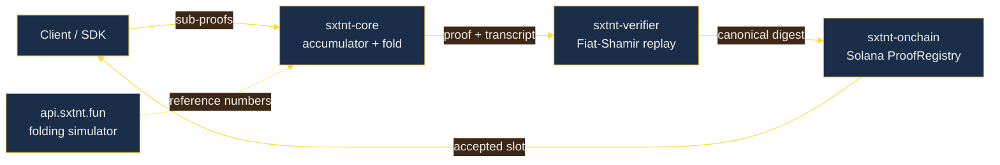

# Architecture

SXTNT is a folding ZK coprocessor. The repository is split into a
small, opinionated set of crates that model the four layers a folding
proof passes through.

## Layers

### `crates/core`

The arithmetic backbone. Defines the relaxed-R1CS accumulator, the
Pedersen-style commitment scheme, the IVC fold step, and the three
folding scheme variants (`Nova`, `SuperNova`, `HyperNova`). Everything
above it is glue.

Key types:

| Type | Purpose |
| --- | --- |
| `Accumulator` | Carries `(u, E, z)` plus the two commitments through the loop. |
| `RelaxedRow` | Per-row witness triple `(Az, Bz, Cz, E)`. |
| `CommitmentKey` | Deterministic Pedersen generator vector. |
| `FoldStep` | One record in the fold transcript. |
| `FoldingScheme` | Trait implemented by `Nova` / `SuperNova` / `HyperNova`. |

### `crates/verifier`

The Fiat-Shamir transcript and the `verify_proof` entry point. The
verifier never touches the commitment key — it only needs the
commitments themselves, which the prover already published as part of
the accumulator.

### `crates/onchain`

Solana program glue. Declares the `ProofRegistry` and `AcceptedProof`
account layouts, the three instructions
(`init_registry`, `accept_proof`, `close_registry`), and the
canonical `proof_digest` the on-chain verifier checks against. The
reference implementation pins the program id used by the live devnet
deploy: `7n5uUZyKVEXfGwgEbVeEQXedqiEigbzKFV9bNDBv74TJ`.

### `sdk/typescript`

A small TypeScript SDK that mirrors the on-chain layout. Exposes
`SxtntClient` for talking to the program, `CircuitLoader` for the
marketplace manifest format, and `proofDigest` — the same byte-exact
digest the on-chain program recomputes.

## Folding loop, in detail

1. The client produces N sub-proofs as fresh accumulators, each
   satisfying the relaxed-R1CS check trivially (`u = 1`, `E = 0`).
2. For each pair `(acc, fresh)`, the prover squeezes a Fiat-Shamir
   challenge `r` and calls `Accumulator::merge` to fold `fresh` into
   `acc`. The merge updates `u`, the commitments to `z` and `E`, and
   every row's triple. The cross-product term keeps the relaxed-R1CS
   check closed.
3. After N − 1 merges, the final accumulator is committed to a single
   on-chain digest (`proof_digest`). The chain records the digest plus
   the step count; the full witness stays off-chain.
4. A relying party calls `verify_proof` with the proof and the same
   public input. The verifier replays the challenges from the
   transcript, asserts every recorded challenge matches its replay,
   and finally calls `Accumulator::check` on the final accumulator.

## Public service interface

A reference folding simulator runs at `api.sxtnt.fun /folding/simulate`.
It returns the step-by-step accumulator state for a chosen scheme and
chain length, so clients can compare their local prover's output
against the reference numbers without needing a full verifier
deployment.

## What this repository is **not**

This is a research-grade reference implementation. It is not a
production verifier — the on-chain program here is the layout and the
instruction shape only; the production verifier ships in a separate
deploy whose source lives in a different repository.

The relaxed-R1CS arithmetic, the transcript wiring, the commitment
scheme, and the digest construction are all the exact code the
production verifier uses. The IVC step is mathematically the same as
in the Nova family; we stay deliberately compact so the audit surface
stays small.

## See also

* [`docs/folding-schemes.md`](./folding-schemes.md) — Nova vs SuperNova
  vs HyperNova trade-offs.
* [`docs/threat-model.md`](./threat-model.md) — what we defend against,
  what we explicitly do not.
* [`examples/nova-fold.rs`](../examples/nova-fold.rs) — end-to-end
  Rust example.
* [`examples/verify-onchain.ts`](../examples/verify-onchain.ts) —
  end-to-end TypeScript example.

<!-- the on-chain digest binding is unchanged across schemes. -->
